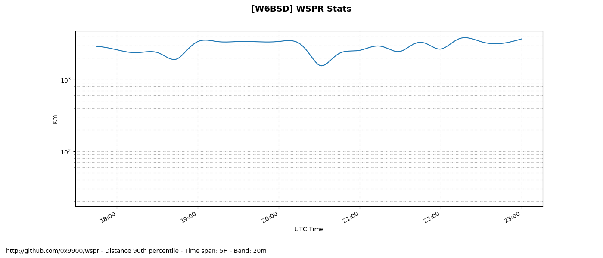

# wspr

WSPR is a digital radio communication mode for probing potential
propagation paths or antenna performance with low-power transmissions.

The Weak Signal Propagation Reporter Network (WSPRnet) is a group of
amateurs radio operators using WSPR with very low power (QRP/QRPp)
transmissions.  They automatically upload their reception reports to a
central database called WSPRnet. This program downloads the data of
these transmission reports create several graphs useful to analyze how
propagation works or to optimize your antenna setting.

## Dependencies

This program depends on the following Python packages: `matplotlib`, `numpy`,
 `requests`. You can also optionally install `mpl_tookints`, if you want to
 display maps.

## Usage

To use this program you need to send wspr data to wsprnet.org. This is
done with either a wsprlite (see down the page) or using the software
WSJT-X. Then you need to get your key from dxplorer.net.

Set the environment variables `CALLSIGN` and `KEY` with your call and
key. The just run the program. The program without any argument will
download from DXplorer your last 24 hours data and graph the
results. You can also call `leaf.py` with the argument `--file`. The
file needs to be a JSON file with the same format as the file provided
by the site DXplorer.

    wspr$ export CALLSIGN="W6BSD"
  	wspr$ export KEY="xxxxxSECRET_KEYxxxxx"
  	wspr$ ./leaf.py --help
    usage: The program leaf.py download the last 24 hours worth of data from WSPR
    net and compute statistical analysis of your contacts.

    To use leaf.py you need to set 2 environment variables one
    with your call sign the second one with your wspr (dxplorer) key.

    For example:
    $ export CALLSIGN="W6BSD"
    $ export KEY="aGAT9om5wASsmx8CIrH48MB8Dhh"

    WSPR Stats.

    optional arguments:
      -h, --help            show this help message and exit
      -D, --debug           Print information useful for debugging
      -t TARGET_DIR, --target-dir TARGET_DIR
                            Target directory where the images will be saved
                            [default: /tmp]
      -f FILE, --file FILE  JSON file from DXPlorer.net
      -b BAND, --band BAND  Band to download, in Mhz [default: 20m]

## Output example

The most classic graph is the maximum distance where your signal was picked up.
This following graph shows the 90th percentile if the distance.

-----

The following box plot graph show for each hour at what distance the
bulk of your communication was heard. It also shows the distance
minima, maxima and the outliers.

-----

The violin graph shows how the station hearing your signal are
distributed in the IQR (Interquartile range).

-----

This histogram graph show at what distance your contacts are made. The
absence or low number of contact indicate the skip zones.

-----

The azimuth graph shows what distance / direction your signal has been
heard.

-----

Pinpoint on a map all your contacts.

-----

## WSPRLite

The WSPRlite is a special test transmitter that sends a signal to a
Worldwide network of receiving stations.

## Thanks

Thanks to Paul Simon (W6EXT) for the Saturday morning coffee discussions on statistics and the best ways to interpret the WSPR data.

For more informations please check this blog posts: [80-meter NVIS antenna][1]

-- Fred C / [W6BSD][2] --

[1]: https://0x9900.com/80-meter-nvis-antenna/
[2]: http://www.qrz.com/db/W6BSD
