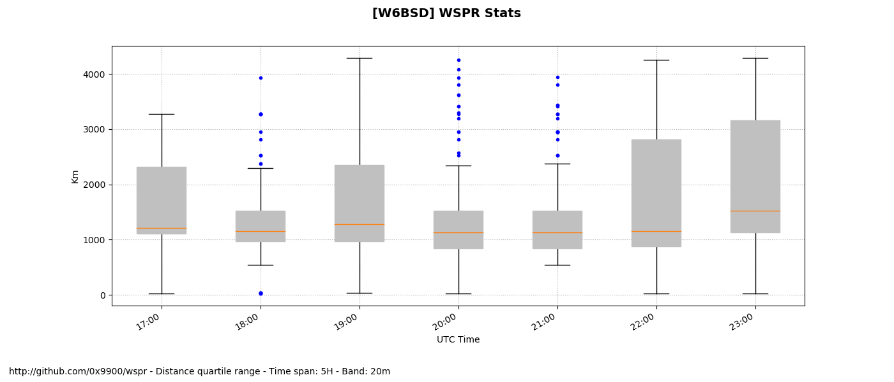
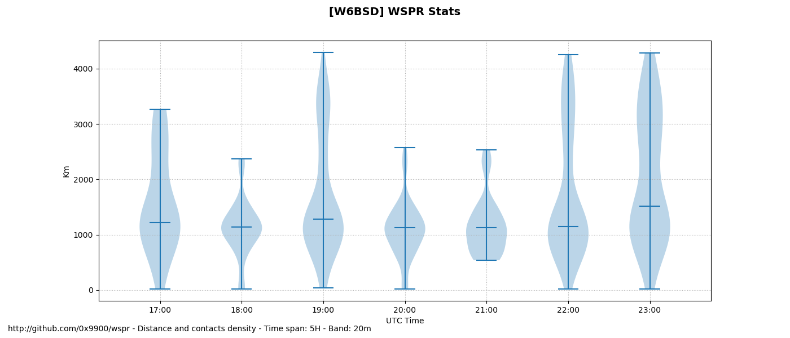
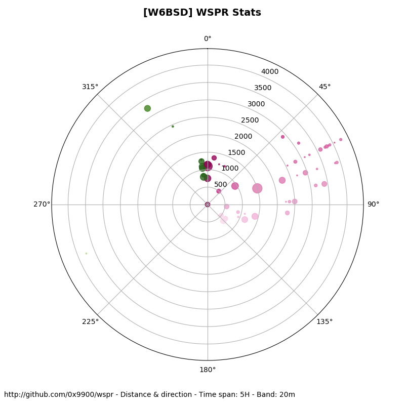

# wspr

WSPR is a digital radio communication mode for probing potential
propagation paths or antenna performance with low-power transmissions.

The Weak Signal Propagation Reporter Network (WSPRnet) is a group of
amateurs radio operators using WSPR with very low power (QRP/QRPp)
transmissions.  They automatically upload their reception reports to a
central database called WSPRnet. This program downloads the data of
these transmission reports create several graphs useful to analyze how
propagation works or to optimize your antenna setting.

## Output example

The following boxplot graph show for each day at what distance the
bulk of your communication was heard. It also shows the distance
minima and maxima as well as the outliers.

The violin graph shows how the station hearing your signal are
distributed in the IQR.

The azimuth graph shows what direction will show if your signal has
been heard more in a specific direction.

## WSPRLite

The WSPRlite is a special test transmitter that sends a signal to a
Worldwide network of receiving stations.

-- Fred C / [W6BSD](http://www.qrz.com/db/W6BSD) --
